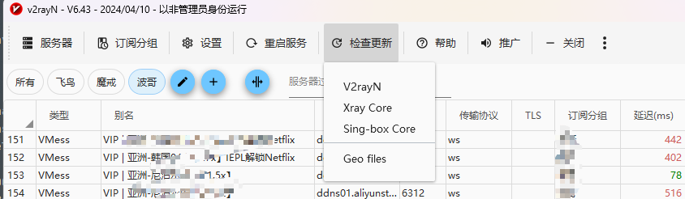
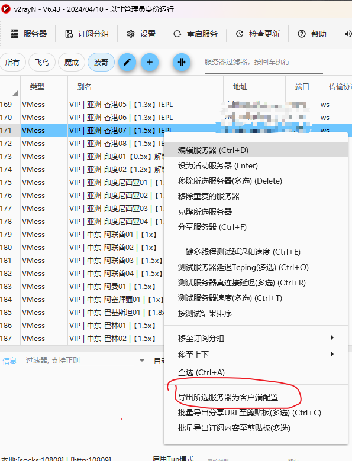

# Candlk

项目服务 公共依赖的父 POM

- Spring Cloud 2021.0.x
- Spring Cloud Alibaba 2021.0.x

### JDK 17 add-opens

```shell
--add-opens=java.base/java.lang=ALL-UNNAMED
--add-opens=java.base/java.io=ALL-UNNAMED
--add-opens=java.base/java.util=ALL-UNNAMED
--add-opens=java.base/java.util.concurrent=ALL-UNNAMED
--add-opens=java.base/java.math=ALL-UNNAMED
# 下面的一般用不到
--add-opens=java.base/java.net=ALL-UNNAMED
--add-opens=java.base/java.nio=ALL-UNNAMED
--add-opens=java.base/java.security=ALL-UNNAMED
--add-opens=java.base/java.text=ALL-UNNAMED
--add-opens=java.base/java.time=ALL-UNNAMED
--add-opens=java.base/jdk.internal.access=ALL-UNNAMED
--add-opens=java.base/jdk.internal.misc=ALL-UNNAMED
--add-opens=java.sql/java.sql=ALL-UNNAMED
```

### Linux 安装V2ray-core 客户端使用代理

V2ray-core官网： https://github.com/v2fly/v2ray-core/releases
v2rayN 客户端：https://github.com/2dust/v2rayN/releases

* 在v2rayN升级V2ray-core到最新版本，并关注所使用的V2ray-core版本！！
  
* 导出服务器的客户端配置`config.json`文件
  
* 前往V2ray-core官网下载对应Linux版本Zip包
  ```shell
  unzip v2ray-linux-64.zip -d v2ray-core
  ```
* 替换导出的`config.json`文件后启动
  ```shell
  ./v2ray-core/v2ray -c config.json
  ```
* 测试
  ```shell
  curl -x http://127.0.0.1:10809 www.baidu.com
  ```
* java使用代理
  ```java
    public static void main(String[] args) {
      String tgMsg = "https://www.baidu.com";
      RestTemplate restTemplate = new RestTemplate();
      SimpleClientHttpRequestFactory reqfac = new SimpleClientHttpRequestFactory();
      reqfac.setProxy(new Proxy(Proxy.Type.HTTP, new InetSocketAddress("127.0.0.1", 10818)));
      restTemplate.setRequestFactory(reqfac);
      JSONObject body = restTemplate.getForEntity(tgMsg, JSONObject.class).getBody();
  }
  ```

| 排名 |                                                           池子                                                            |  算力  | 加成 | 总质押  | :----:                             活跃                                   |  
|:--:|:-----------------------------------------------------------------------------------------------------------------------:|:----:|:--:|:----:|: ---- -----------------------------------------------------------------:|  
| 1  | [GreatPool](https://app.xai.games/pool/0x85343b66e70a24853083a1c15cea27685c927e6f/summary)<font color="red">【变】</font>  | 6.73 | ×3 | 131w | [ <fon t color="red">✘</font>](https://arbiscan.io/address/null)</font> |   
| 2  |               [Sandbar🏝️](https://app.xai.games/pool/0xed03329e096d6532a81b48dced7b02d43aeb3cde/summary)               | 6.11 | ×2 | 23w  |   [<f  ont color="green">✔</font>](https://arbiscan.io/address/null)    |   
| 3  | [LFG!Capita](https://app.xai.games/pool/0xd5ceb0064fa9ffa242eed01e6cfed49b77f1b272/summary)<font color="red">【变】</font> | 5.85 | ×3 | 57w  |   [<f  ont color="green">✔</font>](https://arbiscan.io/address/null)    |   
| 4  |                [NodeOps](https://app.xai.games/pool/0xeb27cab01c52b40ade3cd644f3ecf3cd7a0763b8/summary)                 | 5.63 | ×3 | 71w  |   [<f  ont color="green">✔</font>](https://arbiscan.io/address/null)    |   
| 5  |               [ICOSharks](https://app.xai.games/pool/0x7b325548913a2eb6a1ce456e658dea1bb146055b/summary)                | 5.58 | ×2 | 14w  | [ <fon t color="red">✘</font>](https://arbiscan.io/address/null)</font> |   
| 6  |               [GodBlessCh](https://app.xai.games/pool/0x32bb4731bf5e51a30cae398cee3abc0de061ff1e/summary)               | 5.49 | ×3 | 77w  |   [<f  ont color="green">✔</font>](https://arbiscan.io/address/null)    |   
| 7  |                [XAiverse](https://app.xai.games/pool/0x6c8b53dab8c7cb2da60a450d7f4d47bca6f94b0e/summary)                | 5.34 | ×3 | 157w | [ <fon t color="red">✘</font>](https://arbiscan.io/address/null)</font> |   
| 8  |               [unitycapit](https://app.xai.games/pool/0x80d1a3c84b7c7185dc7dbf4787713d55eea95e27/summary)               | 5.07 | ×3 | 203w |   [<f  ont color="green">✔</font>](https://arbiscan.io/address/null)    |   
| 9  |                [Arbitrum](https://app.xai.games/pool/0xe514bbce56bb134bb88e95a33ec90e015940cd2f/summary)                | 5.05 | ×3 | 134w | [ <fon t color="red">✘</font>](https://arbiscan.io/address/null)</font> |   
| 10 |                [TOGETHER](https://app.xai.games/pool/0x0bb6dd508da137d0e0b7c0d26b4eca824530d854/summary)                | 5.02 | ×3 | 67w  |   [<f  ont color="green">✔</font>](https://arbiscan.io/address/null)    |   
| 11 |               [DOUBLETOP_](https://app.xai.games/pool/0xb7ef6377c93d85abc6f4411378ca9426b5c0d4ce/summary)               | 4.99 | ×2 | 15w  |   [<f  ont color="green">✔</font>](https://arbiscan.io/address/null)    |   
| 12 | [Keyholders](https://app.xai.games/pool/0xd5d93d86e6f0f4bd910014ac760bc3f031cea80b/summary)<font color="red">【变】</font> | 4.98 | ×3 | 62w  |   [<f  ont color="green">✔</font>](https://arbiscan.io/address/null)    |   
| 13 |               [CryptoTelu](https://app.xai.games/pool/0x85026431eab9ca0a99e5666729807208af02a69f/summary)               | 4.76 | ×3 | 142w |   [<f  ont color="green">✔</font>](https://arbiscan.io/address/null)    |   
| 14 |               [ARCcommuni](https://app.xai.games/pool/0x4f72c3fb6d71f4be0b8a9ad592a272662168ab85/summary)               | 4.60 | ×2 | 21w  |   [<f  ont color="green">✔</font>](https://arbiscan.io/address/null)    |   
| 15 |                 [Zeneca](https://app.xai.games/pool/0x59425e14f186619bec8ec0ffcfa8f48d72e3f641/summary)                 | 4.26 | ×2 | 24w  |   [<f  ont color="green">✔</font>](https://arbiscan.io/address/null)    |   
| 16 |               [DOUBLETOP_](https://app.xai.games/pool/0xd54bb7666d1f54a45f8c5eca14dba2e962570900/summary)               | 4.24 | ×2 | 18w  |   [<f  ont color="green">✔</font>](https://arbiscan.io/address/null)    |   
| 17 |                [XAIPOOL](https://app.xai.games/pool/0xbd2cf0ff096c8ad0218262573f368a849caa61e7/summary)                 | 4.12 | ×2 | 11w  |   [<f  ont color="green">✔</font>](https://arbiscan.io/address/null)    |   
| 18 |  [AquaGems](https://app.xai.games/pool/0xc4be9475778df18b6e2a5b9e74cb08a0dab54170/summary)<font color="red">【变】</font>  | 4.10 | ×3 | 91w  |   [<f  ont color="green">✔</font>](https://arbiscan.io/address/null)    |   
| 19 | [LongXiaPoo](https://app.xai.games/pool/0x8e570e4e9819d26834ecc427c4a2b2a064e0af2f/summary)<font color="red">【变】</font> | 4.01 | ×3 | 67w  |   [<f  ont color="green">✔</font>](https://arbiscan.io/address/null)    |   
| 20 |               [ShanyiXAI](https://app.xai.games/pool/0x110a1c87d0ea90e166806ebe5284ea9dcc4a319a/summary)                | 4.01 | ×3 | 286w |    [<font color="red">✘</font>](https://arbiscan.io/address/null)     |